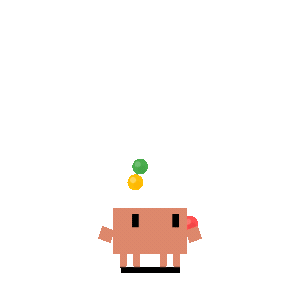

# Clawd — AI Desktop Pet for Windows

<p align="center">
  
  
  
  
  
</p>

<p align="center"><b>Clawd</b> is a pixel-art Claude mascot that lives on your Windows desktop — a virtual pet for AI developers.</p>

<p align="center">
  <a href="https://github.com/KebeliSamet0/clawd/releases/latest"></a>
  <a href="https://www.npmjs.com/package/clawd-desktop"></a>
  <a href="https://www.npmjs.com/package/clawd-desktop"></a>
  
  <a href="https://github.com/KebeliSamet0/clawd/stargazers"></a>
  
</p>

---

Clawd is a transparent, frameless, always-on-top desktop companion built with Electron. The pixel-art Claude mascot wanders around your screen, reacts with different animations while you work, and hides in your system tray when not needed. Perfect for fans of Claude Code, Cursor, Codex, and AI-assisted development.

## Download

Grab the latest `.exe` installer from [**Releases**](../../releases/latest) — no setup required.

Or install globally via npm:

```bash
npm install -g clawd-desktop
clawd-desktop
```

## Features

- **Transparent & frameless** — only the character is visible, no window chrome
- **Roams freely** — wanders your screen, bounces off edges
- **Rich animations** — idle, walking, building, typing, thinking, sleeping, error, happy, juggling, and more
- **System tray control** — Show / Hide / Quit from the tray icon
- **Auto-start with Windows** — always there when you open your PC
- **Lightweight** — built on Electron with vanilla JS, no heavy framework

## Screenshots & Animations

| Typing | Building | Happy | Sleeping |
|--------|----------|-------|---------|
|  |  |  |  |

## Run from Source

```bash
git clone https://github.com/KebeliSamet0/clawd.git
cd clawd
npm install
npm start
```

## Build Installer

```bash
npm run build
# Output: dist/ClaudePet Setup x.x.x.exe
```

## Stack

- **Electron** — window management, system tray, IPC
- **Vanilla JS** — animation state machine, motion engine
- **CSS keyframes** — sprite animations

## Contributing

PRs welcome. Open an issue for bugs or animation ideas.

## License

MIT © [KebeliSamet0](https://github.com/KebeliSamet0)
